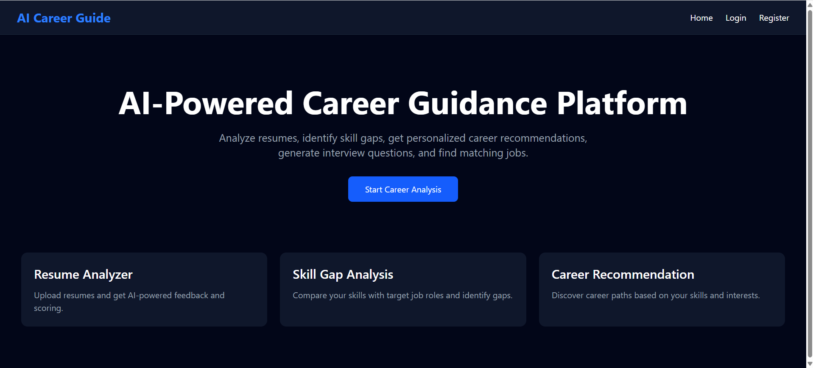
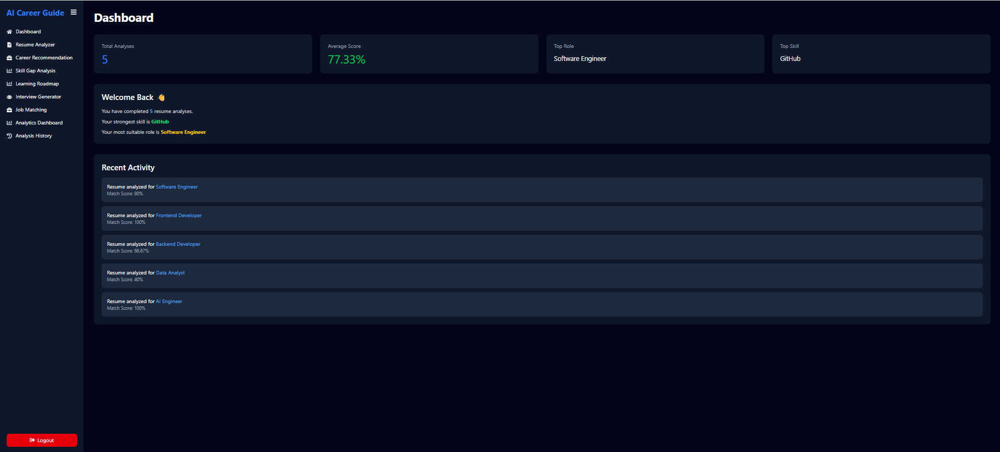
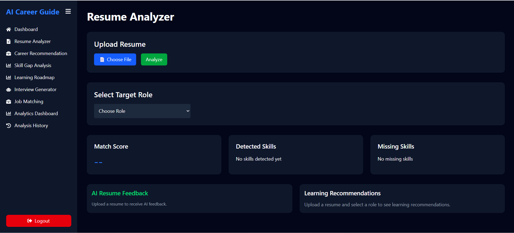
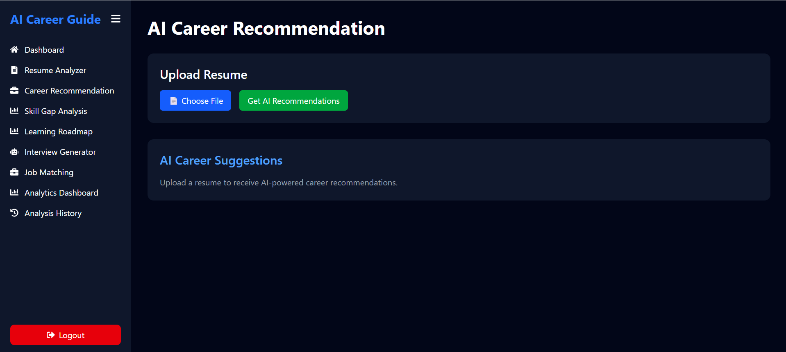
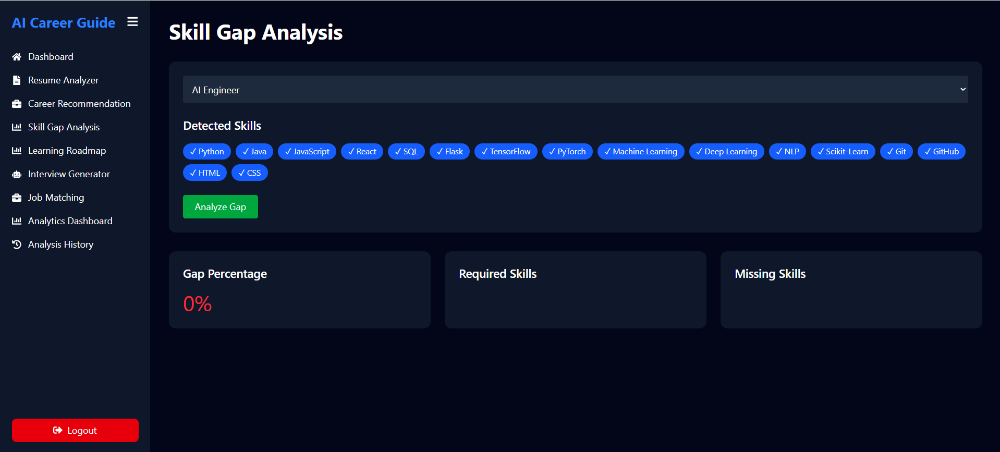
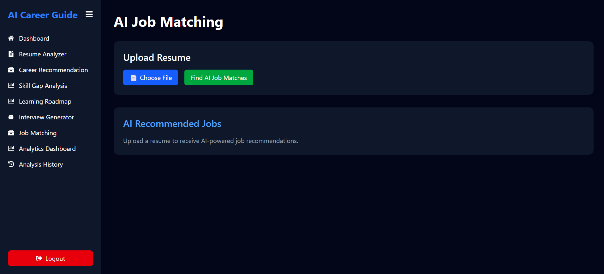
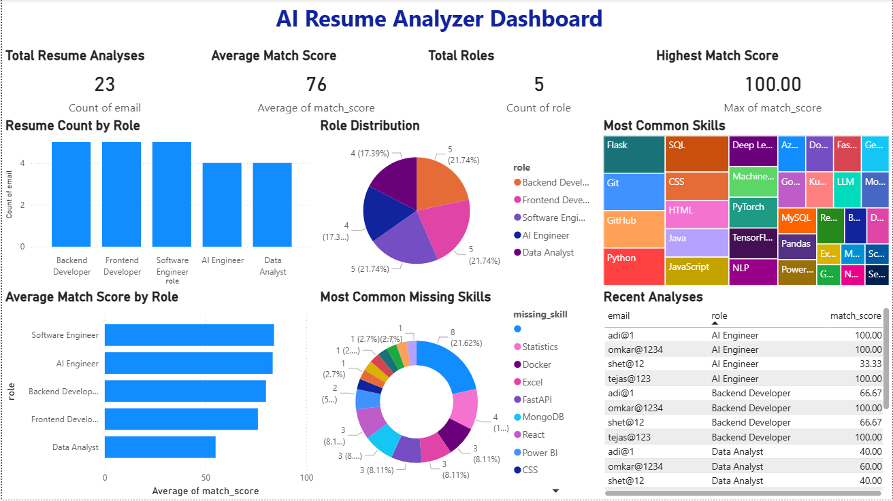

# AI Career Guide 🚀

An AI-powered career guidance platform that helps users analyze resumes, identify skill gaps, receive AI-powered career recommendations, generate interview questions, create personalized learning roadmaps, and match resumes with suitable job roles.

---

# 🌐 Live Demo

### Frontend

https://ai-career-guide-frontend.onrender.com

### Backend API (Swagger)

https://ai-career-guide-backend-weg0.onrender.com/docs

---

# 📌 Features

## 📄 Resume Analyzer

- Upload PDF resumes
- Automatic skill extraction
- Resume match score calculation
- Missing skill detection
- AI-powered resume feedback
- Learning resource recommendations

---

## 🎯 Career Recommendation

- Personalized career suggestions
- AI-driven career path prediction
- Skill-based role recommendations

---

## 📊 Skill Gap Analysis

Compare candidate skills with target job roles and display:

- Required Skills
- Missing Skills
- Match Score
- Gap Percentage

---

## 📚 Learning Roadmap

- Personalized learning roadmap
- Skill improvement recommendations
- Resource suggestions

---

## 💼 Job Matching

- Resume-to-job matching
- Compatibility score
- AI-generated recommendations

---

## 🎤 Interview Question Generator

- Role-specific interview questions
- Beginner to Intermediate difficulty
- AI-generated technical questions

---

## 📜 Analysis History

- Save previous resume analyses
- Track historical reports

---

## 📈 Analytics Dashboard

View insights including:

- Total Resume Analyses
- Average Match Score
- Most Selected Role
- Top Skills
- Recent Analyses

---

## 📊 Power BI Dashboard

Interactive dashboard containing:

- Resume Count by Role
- Role Distribution
- Average Match Score
- Skills Analysis
- Missing Skills Analysis
- Recent Analyses

---

# 🏗 Architecture

Frontend (React + Tailwind CSS)

⬇

FastAPI Backend

⬇

Groq Llama 3.3 70B API

⬇

MongoDB Atlas

⬇

Power BI Dashboard

---

# 🛠 Tech Stack

## Frontend

- React.js
- Tailwind CSS
- Recharts
- Axios

## Backend

- FastAPI
- Python
- Pydantic
- PyMongo

## Database

- MongoDB Atlas

## AI

- Groq API
- Llama 3.3 70B Versatile

## Data Visualization

- Power BI

## DevOps

- Docker
- Docker Compose

## Deployment

- Render
- MongoDB Atlas

## Tools

- Git
- GitHub
- VS Code

---

# 📂 Project Structure

```text
AI-Project/

├── backend/
│   ├── app/
│   ├── routes/
│   ├── database/
│   ├── Dockerfile
│   └── requirements.txt
│
├── frontend/
│   ├── src/
│   ├── pages/
│   ├── components/
│   ├── Dockerfile
│   └── package.json
│
├── powerbi/
│   └── AI_Resume_Analyzer_Dashboard.pbix
│
├── screenshots/
│   ├── home_page.png
│   ├── dashboard_page.png
│   ├── resume_analyzer.png
│   ├── career_recommendation.png
│   ├── skill_gap.png
│   ├── job_matching.png
│   ├── analytics_dashboard_page.png
│   └── powerbi_dashboard.png
│
├── docker-compose.yml
│
└── README.md
```

---

# 📷 Screenshots

## 🏠 Home Page



---

## 📊 Dashboard



---

## 📄 Resume Analyzer



---

## 🎯 Career Recommendation



---

## 📈 Skill Gap Analysis



---

## 💼 Job Matching



---

## 📊 Analytics Dashboard


---

## 📈 Power BI Dashboard



---

# ⚙️ Installation

## Clone Repository

```bash
git clone https://github.com/tejasvi-shet/AI-Project.git

cd AI-Project
```

---

## Backend

```bash
cd backend

python -m venv venv

venv\Scripts\activate

pip install -r requirements.txt

uvicorn app.main:app --reload
```

Runs on:

```
http://127.0.0.1:8000
```

---

## Frontend

```bash
cd frontend

npm install

npm run dev
```

Runs on:

```
http://localhost:5173
```

---

# 🐳 Docker

Build Docker images

```bash
docker compose build
```

Run containers

```bash
docker compose up
```

Stop containers

```bash
docker compose down
```

---

# ☁️ Deployment

The application is deployed on **Render**.

### Frontend

https://ai-career-guide-frontend.onrender.com

### Backend

https://ai-career-guide-backend-weg0.onrender.com

### Database

MongoDB Atlas

The application is fully containerized using Docker and can also be deployed on:

- Render
- Docker Compose
- Microsoft Azure
- AWS
- Google Cloud Platform

---

# 📊 Power BI Dashboard

The project includes an interactive Power BI dashboard providing insights into:

- Resume Analysis Trends
- Average Match Score
- Role Distribution
- Top Skills
- Missing Skills
- Recent Analyses

Dashboard File:

```
powerbi/AI_Resume_Analyzer_Dashboard.pbix
```

---

# 👨‍💻 Author

**Tejasvi Shet**

Final Year Computer Engineering Student

GitHub:
https://github.com/tejasvi-shet

LinkedIn:
https://linkedin.com/in/tejasvi-shet

---

# 📄 License

This project is developed for educational and portfolio purposes.
